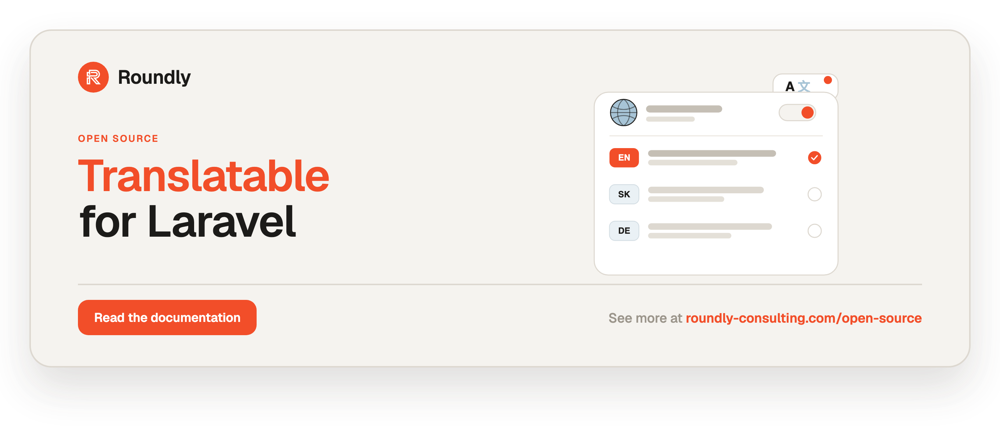

<p align="center">
  <a href="https://roundly-consulting.com/open-source">
    
  </a>
</p>

# translatable-for-laravel

Locale-map (`jsonb`) translatable attributes with a fallback chain for Eloquent — native, with
zero third-party dependencies.

A single `json`/`jsonb` column stores a plain `{ "en": "…", "sk": "…" }` map per attribute.
Reads return the current locale through a configurable fallback chain so content never renders
blank. Per-locale slugs come from
[`sluggable-for-laravel`](https://github.com/roundly-consulting/sluggable-for-laravel), which
reads and writes translatable attributes through this package's contract (see
[Slugs](#slugs)). This is the org-wide native solution for multi-locale Eloquent attributes.

## Requirements

- PHP 8.4+
- Laravel 12 or 13
- `roundly-consulting/enums-for-laravel` (installed automatically) — backs the `FallbackMode` enum
- `roundly-consulting/package-toolkit-for-laravel` (installed automatically) — the service-provider
  builder, the `DatabaseDriver` enum, and the `LIKE` escaper behind the search helper
- `roundly-consulting/sluggable-for-laravel` (installed automatically) — per-locale slugs over
  translatable attributes; this package's `Translatable` contract extends its
  `ProvidesLocaleMaps`
- Any Laravel-supported database (`ilike` is used on PostgreSQL, an escaped `like` elsewhere).

## Installation

```bash
composer require roundly-consulting/translatable-for-laravel
```

Optionally publish the config and the validation language lines:

```bash
php artisan vendor:publish --tag="translatable-config"
php artisan vendor:publish --tag="translatable-translations"
```

There is **no** migrations tag — you write your own tables using the `translatable()` column
macro below.

## Configuration

`config/translatable.php`:

```php
return [
    // Locale used when a requested locale has no value (FallbackMode::Fallback / Any, step 2).
    'fallback_locale' => env('TRANSLATABLE_FALLBACK_LOCALE', config('app.fallback_locale', 'en')),

    // How far the fallback chain reaches. none = exact only; fallback = exact -> fallback
    // locale; any = exact -> fallback locale -> first available (content never renders blank).
    // NOTE: `any` can surface a value from another locale when the requested + fallback
    // locales are empty — a cross-locale disclosure. See "Fallback modes" below.
    'fallback' => FallbackMode::tryFrom((string) env('TRANSLATABLE_FALLBACK', 'any')) ?? FallbackMode::Any,

    // Reject any locale key not in the supported list on writes (malformed keys are always
    // rejected regardless). Off by default, so any well-formed locale is accepted.
    'strict_locales' => (bool) env('TRANSLATABLE_STRICT_LOCALES', false),

    // Default supported locales. Hosts SHOULD rebind SupportedLocales to their own source.
    'locales' => ['en', 'sk'],
];
```

| Key | Type | Default | Env | Purpose |
|-----|------|---------|-----|---------|
| `fallback_locale` | `string` | `app.fallback_locale` / `en` | `TRANSLATABLE_FALLBACK_LOCALE` | Locale tried after the exact one. |
| `fallback` | `FallbackMode` | `FallbackMode::Any` | `TRANSLATABLE_FALLBACK` (`none`/`fallback`/`any`) | How far the fallback chain reaches. |
| `strict_locales` | `bool` | `false` | `TRANSLATABLE_STRICT_LOCALES` | Reject writes for locales outside the supported list. |
| `locales` | `list<string>` | `['en', 'sk']` | — | Default supported locales. |

The package works with **zero** host configuration. Slug options (separator, word cap, reserved
words, …) live in `config/sluggable.php`.

### One source of truth for locales

Bind the `SupportedLocales` contract in your app's service provider to wrap a single source of
truth (used by `Translations`, `missingLocales`, `fromInput` — and by sluggable, see below):

```php
use RoundlyConsulting\Translatable\Contracts\SupportedLocales;

$this->app->bind(SupportedLocales::class, fn () => new class implements SupportedLocales {
    /** @return list<string> */
    public function supported(): array
    {
        return App\Localization\Locale::SUPPORTED;
    }
});
```

Translatable also binds sluggable's `SlugLocales` contract to `TranslatableSlugLocales`, an adapter
over the same `SupportedLocales`, `translatable.fallback_locale` and the app locale — so slugs are
generated, indexed and bound for exactly the locales your translations use. Sluggable registers
its own default with `bindIf()`, so provider order doesn't matter; your own `SlugLocales` binding
in a later provider wins over both.

## Usage

### Translatable attributes

List the translatable attributes in a `public array $translatable` property and implement the
`Translatable` contract (the trait provides every method). The model needs **no** `array` cast —
the trait owns JSON serialization for its listed attributes.

```php
use Illuminate\Database\Eloquent\Model;
use RoundlyConsulting\Translatable\Concerns\HasTranslations;
use RoundlyConsulting\Translatable\Contracts\Translatable;

final class Topic extends Model implements Translatable
{
    use HasTranslations;

    /** @var list<string> */
    public array $translatable = ['name', 'description'];
}
```

```php
$topic->name;                                 // localized, fallback chain
$topic->getTranslation('name', 'sk');         // explicit locale, fallback on
$topic->getTranslation('name', 'sk', false);  // no fallback -> null if missing
$topic->translatedOrNull('name');             // app locale, NO fallback
$topic->getTranslations('name');              // full map (admin resources)
$topic->getTranslations();                    // every translatable attr -> its map
$topic->setTranslation('name', 'sk', 'Investovanie'); // fluent, returns $this
$topic->setTranslation('name', 'sk', null);   // forgets sk (never stores blank)
$topic->setTranslations('name', ['en' => 'Investing', 'sk' => 'Investovanie']);
$topic->replaceTranslations(['name' => ['en' => 'Investing']]);
$topic->forgetTranslation('name', 'sk');
$topic->forgetAllTranslations('name');
$topic->hasTranslation('name', 'sk');         // bool
$topic->getTranslatedLocales('name');         // list<string>
$topic->missingLocales('name');               // supported - translated (feed an AI service)
$topic->isTranslatableAttribute('name');      // bool
$topic->getTranslatableAttributes();          // list<string>
$topic->name = 'Investing';                   // sets the APP locale value
$topic->name = ['en' => 'Investing', 'sk' => 'Investovanie']; // replaces the map
```

Blank/`null` values are dropped, so a map never stores an empty string and the fallback chain
always has something real to fall back to.

### Locale keys are validated on write

Every write path (`$model->name = [...]`, `setTranslation`, `setTranslations`, mass assignment)
validates its locale **keys**. Malformed keys — anything with quotes, spaces, markup or SQL, e.g.
a mass-assigned `name[<script>]=…` — are rejected with an `InvalidLocaleException`; values must be
scalars (strings, or ints/floats cast to string), so a nested-array payload raises an
`InvalidTranslationValueException` instead of being stored. Turn on `strict_locales` to also reject
well-formed keys that aren't in your supported list.

**Route raw request maps through `Translations::fromInput()`** — it drops unsupported and blank
locales *before* they reach the model, so untrusted `$request->input('name')` never triggers a
write-path exception:

```php
$topic->setTranslations('name', Translations::fromInput($request->input('name')));
// or validate first with Translations::rules('name', required: true)
```

### Serialization (`toArray` / `toJson` / API Resources)

`toArray()`, `toJson()`, `response()->json($model)`, and API Resources emit the **resolved locale
value** for each translatable attribute — identical to `$model->name` — not the raw stored JSON
map:

```php
$topic->toArray()['name'];   // "Investing"  (localized, through the fallback chain)
$topic->toJson();            // {"name":"Investing", …}
TopicResource::make($topic); // {"name":"Investing"}
```

The effective `FallbackMode` is honoured (a `None` model with only `sk` set serializes `name` as
`null` for an `en` request). Persisted data is untouched — this changes output shape only. When an
admin screen needs the full map, call `getTranslations('name')` explicitly.

### Whole-model translation status

For admin completeness UIs, query status across every translatable attribute in one call:

```php
$topic->missingTranslations();     // ['description' => ['sk']]  field => missing locales
$topic->isFullyTranslated();       // bool — every field has every supported locale
$topic->isFullyTranslated('name'); // bool — one attribute
$topic->translationCompleteness(); // 0.0–1.0 — filled / (fields × locales), for a progress bar
```

Exclude a column (e.g. the slug) from a "content complete" bar by overriding a protected method:

```php
/** @return list<string> */
protected function translationStatusExcludes(): array
{
    return ['slug'];
}
```

### Translation-changed event (opt-in)

Add the `DispatchesTranslationEvents` trait to have the model dispatch a single
`TranslationsChanged` event once per persisted save when any translatable attribute changed —
ideal for queuing an AI service to fill `missingLocales()` or busting a cache, without overriding
the model. The base `HasTranslations` trait stays side-effect-free; nothing fires unless you opt in.

```php
use RoundlyConsulting\Translatable\Concerns\DispatchesTranslationEvents;
use RoundlyConsulting\Translatable\Concerns\HasTranslations;

final class Topic extends Model implements Translatable
{
    use HasTranslations;
    use DispatchesTranslationEvents;
    // …
}
```

```php
use RoundlyConsulting\Translatable\Events\TranslationsChanged;

Event::listen(TranslationsChanged::class, function (TranslationsChanged $event): void {
    foreach ($event->changedAttributes as $attribute) {          // list<string>
        if ($event->model->missingLocales($attribute) !== []) {
            FillMissingTranslations::dispatch($event->model, $attribute);
        }
    }
});
```

### Query scopes

Driver-agnostic JSON-path scopes over supported locales (work on any Laravel database):

```php
Topic::query()->whereLocale('name', 'Investing', 'en'); // exact per-locale value (locale defaults to app locale)
Topic::query()->whereHasLocale('name', 'sk');           // rows with a non-blank 'sk' value
Topic::query()->whereMissingLocale('name', 'sk');       // rows missing 'sk' (feed an AI-fill queue)
```

### Reading in another locale

Read a model in a locale other than the request locale without mutating global state — the app
locale is swapped for the closure and always restored afterwards (even on an exception):

```php
use RoundlyConsulting\Translatable\Facades\Translatable;

$sk = Translatable::usingLocale('sk', fn (): string => $topic->name); // 'Investovanie'
```

### The `Translatable` facade

The reusable toolkit is discoverable, injectable, and swappable in host tests via the `Translatable`
facade over a bound `TranslationManager` (the static `Translations::…` helpers delegate to the same
manager, so a swapped fake is observed everywhere):

```php
use RoundlyConsulting\Translatable\Facades\Translatable;

$locales = Translatable::supported();                 // list<string>
$map     = Translatable::fromInput($request->input('name'));
$current = Translatable::currentLocale();
$mode    = Translatable::fallbackMode();               // FallbackMode
$fb      = Translatable::fallbackLocale();             // string

// In a test:
Translatable::swap($fakeManager);
```

### Fallback modes

The `FallbackMode` enum drives resolution:

- `FallbackMode::None` — exact requested locale only.
- `FallbackMode::Fallback` — exact, then the configured fallback locale.
- `FallbackMode::Any` — exact, then fallback locale, then the first available value.

> **Cross-locale disclosure with `Any` (the shipped default).** When both the requested and
> fallback locales are empty, `Any` renders the **first available** locale's value — so content you
> deliberately left untranslated for a locale can still appear in another language. If some content
> is legally or compliance gated per locale, switch to `Fallback` (or `None`) globally via
> `TRANSLATABLE_FALLBACK`/config, or per model with `$translatableFallbackMode`. `Any` is kept as
> the default so content never renders blank; the tradeoff is this leak.

Override per model:

```php
use RoundlyConsulting\Translatable\Enums\FallbackMode;

protected ?FallbackMode $translatableFallbackMode = FallbackMode::Fallback;
protected ?string $translatableFallbackLocale = 'en';
```

### Migrations

```php
use Illuminate\Database\Schema\Blueprint;
use Illuminate\Support\Facades\Schema;

Schema::create('topics', function (Blueprint $table): void {
    $table->id();
    $table->translatable('name');          // jsonb column
    $table->translatable('description')->nullable();
    $table->localizedSlug('slug');         // sluggable's macro — jsonb / json / text per engine
    $table->timestamps();
});
```

### Slugs

Slugs are owned by [`sluggable-for-laravel`](https://github.com/roundly-consulting/sluggable-for-laravel)
(installed with this package). A translatable model gets per-locale slugs with two traits and two
interfaces — no cast, no glue:

```php
use Illuminate\Database\Eloquent\Model;
use RoundlyConsulting\Sluggable\Concerns\HasSlug;
use RoundlyConsulting\Sluggable\Contracts\Sluggable;
use RoundlyConsulting\Sluggable\Definitions\SlugDefinition;
use RoundlyConsulting\Sluggable\Definitions\SlugOptions;
use RoundlyConsulting\Translatable\Concerns\HasTranslations;
use RoundlyConsulting\Translatable\Contracts\Translatable;

final class Topic extends Model implements Translatable, Sluggable
{
    use HasTranslations;
    use HasSlug;

    /** @var list<string> */
    public array $translatable = ['name', 'description', 'slug'];

    public function slugOptions(): SlugOptions
    {
        return SlugOptions::make(
            SlugDefinition::for('slug')->from('name')->routeKey(),
        );
    }

    /** @return list<string> */
    protected function translationStatusExcludes(): array
    {
        return ['slug'];
    }
}

$topic = Topic::create(['name' => ['en' => 'Investing', 'sk' => 'Investovanie']]);
$topic->getTranslations('slug');   // ['en' => 'investing', 'sk' => 'investovanie']
```

How it fits together:

- `Translatable` extends sluggable's `ProvidesLocaleMaps`; `HasTranslations` implements it
  (`isLocaleMapAttribute()` → `isTranslatableAttribute()`, `getLocaleMap()` → `getTranslations()`,
  `setLocaleMap()` → `setTranslations()`). Sluggable therefore detects the `slug` attribute as a
  locale map, builds the `sk` slug from the `sk` name regardless of the request locale, and every
  slug it writes goes through translatable's locale-key validation and `strict_locales`.
- **The model must `implements Translatable`.** A model that uses `HasTranslations` without the
  interface has no cast on its `slug`, so sluggable refuses it with
  `InvalidSlugDefinitionException` (`localeMapContractMissing`) rather than treating the jsonb
  column as a plain string.
- Uniqueness, engine-native unique indexes (`SlugIndexes`, `php artisan sluggable:indexes`),
  querying (`whereSlug`, `whereSlugInAnyLocale`, `findBySlug`), route binding, the `UniqueSlug`
  validation rule, slug history and redirects are all sluggable's — see its README.

### Migrating from `HasTranslatableSlug`

Translatable no longer ships a slug feature. Replace it like this (no data migration — the stored
`{"en": "…"}` map is identical, and sluggable's default output is byte-identical to `Str::slug()`):

| Removed | Use instead |
|---|---|
| `Concerns\HasTranslatableSlug` | `RoundlyConsulting\Sluggable\Concerns\HasSlug` + the `Sluggable` contract |
| `$table->translatableSlug()` | `$table->localizedSlug()` |
| `Support\TranslatableSlug::uniqueIndexes()` | `SlugIndexes::forModel(Topic::class)` / `SlugIndexes::ensure(SlugIndexSpec::localeMap(...))` |
| `Rules\UniqueTranslatedSlug`, `TranslatableSlug::assertUnique()` | `RoundlyConsulting\Sluggable\Rules\UniqueSlug::for(Topic::class)->ignore($topic)` |
| `php artisan translatable:slug-indexes` | `php artisan sluggable:indexes "App\Models\Topic"` |
| `DataTransferObjects\SlugOptions`, `UniqueSlugContext` | `SlugDefinition` / the rule's fluent API |
| `translatable.slug.*` config | `config/sluggable.php` (`defaults.*`, `reserved`) |
| `translatable::validation.unique_slug` | `sluggable::validation.unique_locale` |
| `whereLocaleSlug()` / `whereAnySlug()` | `whereSlug()` / `whereSlugInAnyLocale()` |
| `protected bool $resolveSlugBindingById` | `->bindByKeyFallback()` |

Behaviour changes with sluggable's defaults, and how to keep the old behaviour:

| Behaviour | Before | After (default) | To keep the old behaviour |
|---|---|---|---|
| generation on update | never (create only) | fill missing locales (`IfEmpty`) | `->immutable()` |
| manual slug | stored verbatim, never uniquified | normalised + uniquified | `->manual(ManualSlugPolicy::Strict)` (verbatim, throw on collision) |
| source field | `translatable.slug.source_field` | `->from('name')` / `sluggable.defaults.source` | — |
| word cap | 12 words | none | `->maxWords(12)` |
| probing | 50 sequential (one query each), then an unbounded random loop | 50 sequential in batches of 10, then ≤ 10 random, then `SlugGenerationException` | — |
| no-op save | n/a | `IfEmpty` back-fill needs a real change, `regenerateSlugs()` or `sluggable:regenerate --mode=missing` | — |
| DB indexes | PostgreSQL only | PostgreSQL, MySQL and SQLite | — |
| "taken" semantics | generation honoured global scopes (a tenant/`published`/SoftDeletes scope hid collisions); the rule excluded trashed rows; the pg index included them | one semantics everywhere: no global scopes, trashed rows count as taken | `->excludeTrashed()` + an exclude-trashed index (drop the legacy index first) |
| collisions hidden by global scopes | duplicate slug, then a raw unique violation on PostgreSQL | suffixed (`-2`) | `->uniqueWithin('tenant_id')` for per-tenant slugs |
| race retries | 5 | 3 (`sluggable.concurrency.retries`) | `->retries(5)` |
| binding chain | current → fallback → any | same (`LocaleFallback::Any`) | — |

**Existing PostgreSQL indexes.** `TranslatableSlug::uniqueIndexes()` named its indexes
`{table}_{column}_{locale}_unique`; sluggable names them `{table}_{column}_{locale}_slug_unique`.
Calling `SlugIndexes::ensure()` on such a table creates a **second**, equivalent index — drop the
old ones first (or skip `ensure()` for those tables; the retry matcher also recognises a violation
that names the slug column). The legacy indexes include trashed rows, matching sluggable's default;
switching a definition to `->excludeTrashed()` requires dropping them, otherwise sluggable raises
`SlugGenerationException::constraintMismatch`.

### Admin validation

```php
use RoundlyConsulting\Sluggable\Rules\UniqueSlug;
use RoundlyConsulting\Translatable\Support\Translations;

public function rules(): array
{
    // Extend the slug rules rather than re-declaring `slug`: a second `'slug' => […]` key would
    // silently replace `sometimes|array` and let a non-map value through.
    $slug = Translations::rules('slug', required: false);
    $slug['slug'][] = UniqueSlug::for(Topic::class)->ignore($this->route('topic'));   // sluggable's rule

    return [...Translations::rules('name', required: true), ...$slug];
}
```

Cap length or add custom per-locale value rules via the `each` parameter (applied to every
locale of the field):

```php
...Translations::rules('name', required: true, each: ['max:120']);
```

Other `Translations` helpers:

- `Translations::fromInput($input)` — normalise input into a locale map (a bare string becomes
  the current locale; blank and unsupported locales are dropped). Ideal for DTO mapping.
- `Translations::apply($model, new TranslationChanges([...]))` — PATCH-merge: only supplied
  locales are touched.
- `Translations::whereLike($query, new TranslationSearch(fields: ['name'], term: 'invest'))` —
  per-locale, case-insensitive search across the supported locales (`ilike` on PostgreSQL, `like`
  everywhere else).

  The term is treated as a **literal substring**: `%`, `_` and `\` are escaped, and the SQL states
  its escape character explicitly, so a search for `100%` or `a_b` finds exactly those rows on
  every driver — including SQLite and SQL Server, which have no default `LIKE` escape character.
  The needle is always bound; only the searched field name (validated as a plain identifier)
  reaches the SQL.

### Missing-locale badge (Blade)

Drop the "which locales are still missing" badge every admin form repeats into any Blade view:

```blade
<x-translatable-status :model="$topic" />
```

It renders each field's missing locales for a partial model, or a "complete" badge when the model
is fully translated (respecting `translationStatusExcludes()`).

### Storage format

Values are stored as a plain `{ "en": "…", "sk": "…" }` JSON object — no vendor wrapper. Rows
written by the hand-rolled "json cast + locale accessor" pattern read back identically, so
there is **no data migration** when adopting this package.

### `php artisan about`

The package contributes a `Translatable` section reporting its shape — how many locales are
configured and where they come from, the fallback mode, the fallback-locale and strict-locale
switches:

```bash
php artisan about --only=translatable
```

It reports **counts and switches, never values**: your locale list is never printed. (Slug
settings appear in sluggable's own `about` section.)

## Testing

```bash
composer test
```

The suite runs on SQLite by default. Point it at a real engine with the standard
`TESTING_DB_*` vars — `TESTING_DB_DRIVER` is the one that actually moves it:

```bash
TESTING_DB_DRIVER=pgsql TESTING_DB_HOST=127.0.0.1 TESTING_DB_PORT=5432 \
  TESTING_DB_DATABASE=testing TESTING_DB_USERNAME=testing TESTING_DB_PASSWORD=secret \
  vendor/bin/pest
```

CI runs all three engines, and each one earns its place:

| Leg | What only it can catch |
|---|---|
| **sqlite** | a `LIKE` with no `ESCAPE` clause. SQLite has no default LIKE escape character, so an unescaped term matches **nothing** — while the same code is green on PostgreSQL and MySQL. This package shipped exactly that bug. |
| **pgsql** | the PostgreSQL-only surface: the `ilike` path and real `jsonb` columns — including sluggable's per-locale slugs over them. |
| **mysql** | the `like` branch on a real server. Everything that is not PostgreSQL takes that branch, so without this leg "not PostgreSQL" was only ever proven against SQLite — the one engine that disagrees with MySQL about escaping. |

The PostgreSQL-only cases skip visibly when no engine is reachable, so a run that asserts
nothing cannot report green.

## Changelog

See [CHANGELOG.md](CHANGELOG.md).

## License

The MIT License (MIT). Copyright (c) roundly-consulting. See [LICENSE.md](LICENSE.md).
